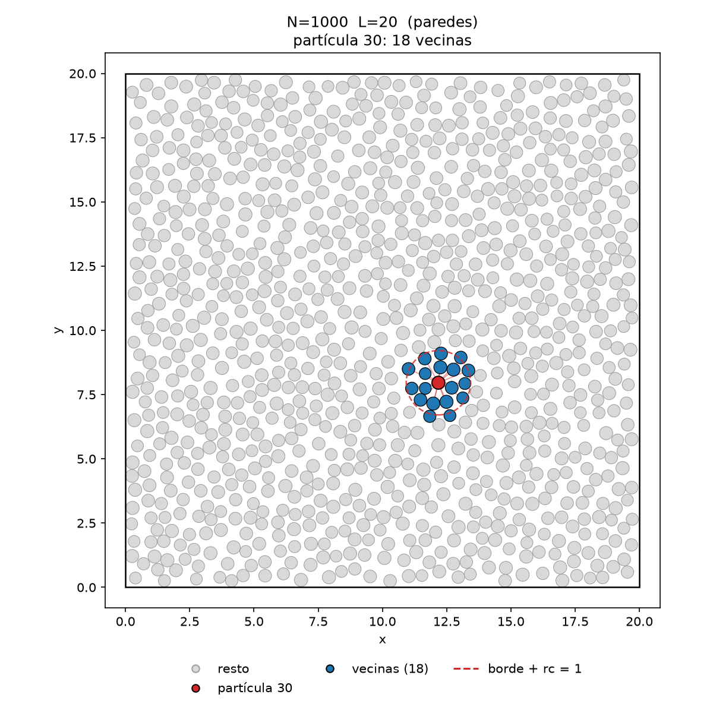
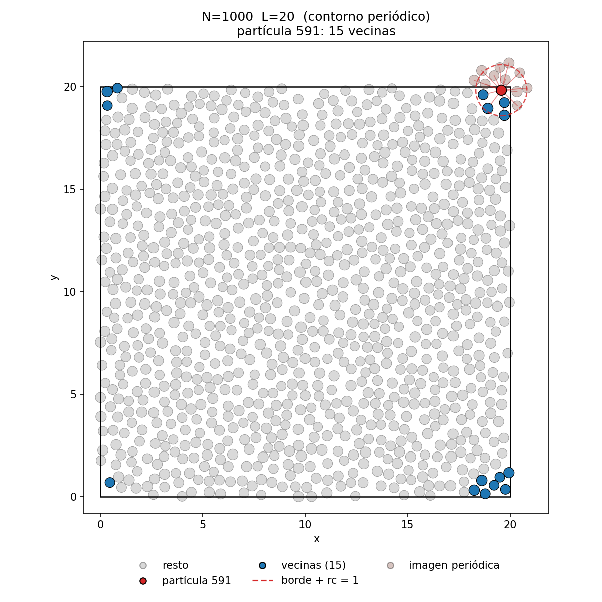
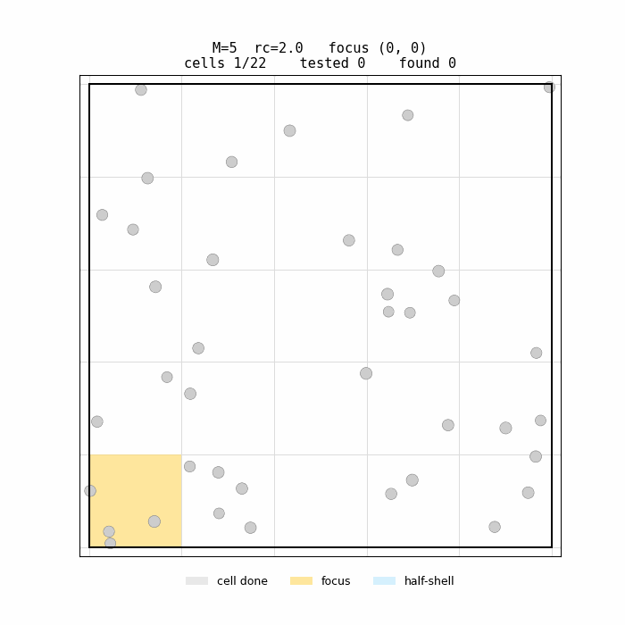
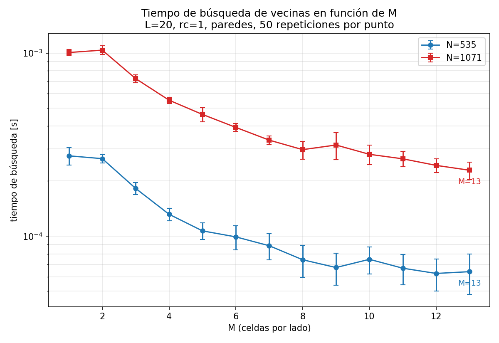
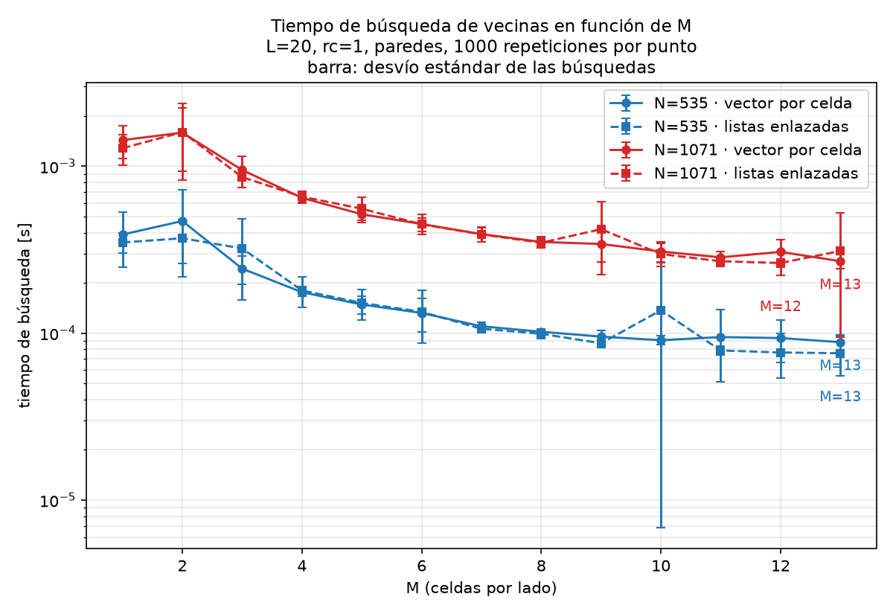
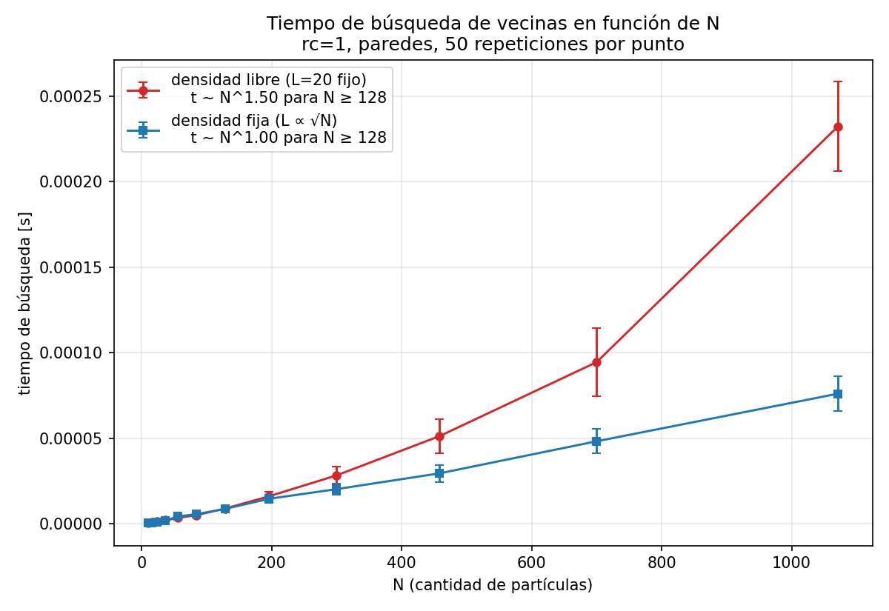
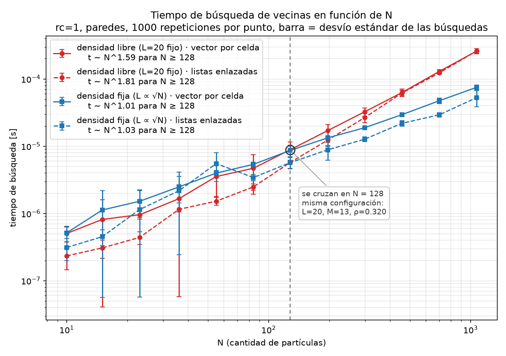
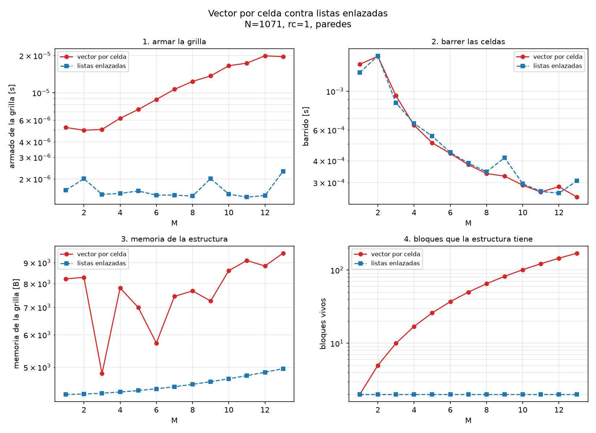
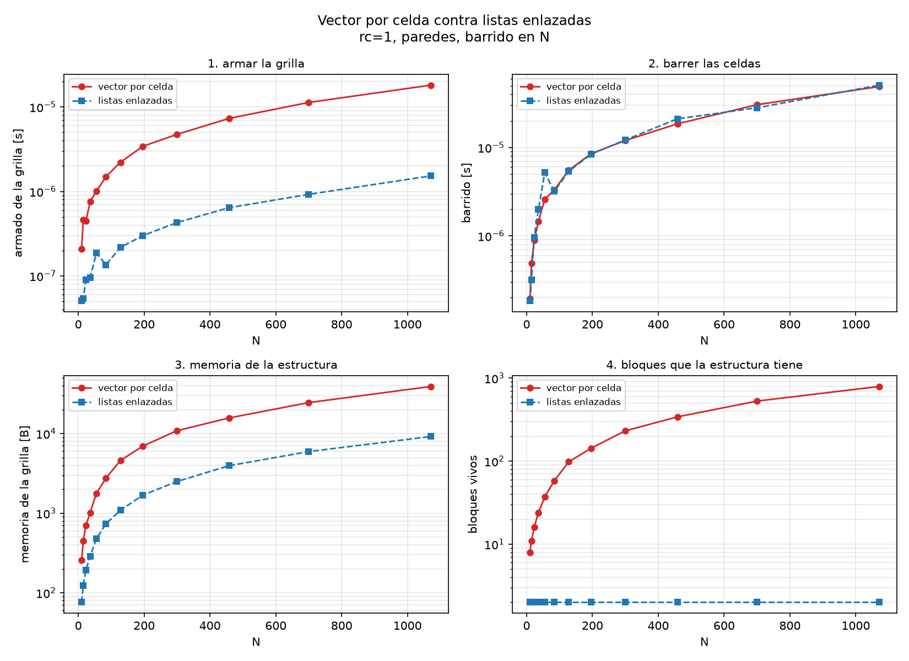

# Resultados

Las figuras que deja `./run_all.sh` en `images/`, y cómo leerlas.

## Punto 1 — vecinas de una partícula

Todas las partículas a escala real, la elegida en rojo y sus vecinas en azul. El anillo
punteado está a `r_i + rc` del centro: todo lo que lo toca con su **borde** es vecina.

La misma figura con contorno periódico. La partícula 591 cae en una esquina, así que
sus vecinas quedan repartidas en las **cuatro esquinas** de la caja: la interacción
cruza el borde por imagen mínima.

## El barrido del CIM, paso a paso

Celda foco en amarillo, celdas del half-shell en celeste, y cada par medido en verde si
cae dentro de `rc` o rojo si no. `N=40`, `L=20`, `rc=2`, `M=5`.

En gris, las celdas que ya no tienen ningún par pendiente. Ojo que **no** es lo mismo
que "ya fue foco": el half-shell incluye `SE = (+1, -1)`, que baja a la fila anterior,
así que una celda que ya tuvo su turno de foco todavía se abre una vez más, desde el
foco que está una fila más arriba y una columna más atrás. Recién ahí queda cerrada, y
por eso el gris va una fila atrás del foco.

El mismo barrido con contorno periódico muestra que ahí el half-shell **nunca descarta
celdas**: las que se salen por un borde reaparecen por el opuesto.

## Punto 3 — tiempo en función de M

`L=20`, `rc=1`, paredes, 1000 búsquedas por punto, una curva por `N`. `M=1` es la
fuerza bruta. El tiempo cae hasta que la curva entra en una meseta; el óptimo es
`M=13`, **4.0x más rápido** que el peor `M` para `N=535` y **5.1x** para `N=1071`. En
los dos casos es un mínimo neto, sin empate a 2 sigma.

El estudio extra de listas enlazadas sale de este mismo CSV, en una figura aparte: son
cuatro curvas en vez de dos y tapan lo que el punto 3 quiere mostrar, así que van
separadas. El color distingue `N` y el trazo la estructura.

Las dos estructuras dan el mismo `M=13`. El costo de armar la grilla crece con `M` y no
crece igual para las dos, así que los óptimos podrían haber quedado separados, pero no
llegan a separarse: `M=13` es el máximo que permite el criterio `L/M ≥ rc + 2·r_max`, y
las dos curvas todavía están bajando cuando lo alcanzan. O sea que el óptimo cae en el
borde del rango permitido y no en un mínimo interior.

En el óptimo, las listas enlazadas dan 0.86x el tiempo del vector por celda para `N=535`
y 0.92x para `N=1071`.

## Punto 4 — tiempo en función de N

Con `M=13`, los dos regímenes de densidad. A **densidad fija** (`L ∝ √N`) el CIM escala
lineal, `t ~ N^1.02`, que es la propiedad que lo justifica; a **densidad libre** (`L=20`)
la densidad crece con `N` y el exponente sube a `t ~ N^1.63`, porque cada celda acumula
cada vez más partículas.

Y otra vez la versión con las dos estructuras, aparte por lo mismo que en el punto 3.
Con listas enlazadas los exponentes dan `t ~ N^1.00` a densidad fija y `t ~ N^1.77` a
densidad libre.

Los exponentes de las dos estructuras coinciden dentro del ruido del ajuste, que es lo
esperable porque corren el mismo barrido y miden los mismos pares. Lo que las separa es
el prefactor: a densidad fija y `N=1071` el costo por partícula es 76.9 ns contra
49.7 ns, o sea 0.65x.

El piso de ruido de la corrida es **0.8%**, medido y no supuesto: en `N=128` las dos
curvas cronometran el mismo archivo, así que todo lo que difieran ahí es error de
medición. El cruce medido cae en `N=125.8` contra el `N=128` que corresponde por
construcción, un 1.7% de desvío.

**Por qué las barras son enormes a `N` chico.** La barra es el desvío estándar de las
búsquedas, que es lo que pide la cátedra. En `N=15` una búsqueda tarda 1.29 µs y el
desvío da 2.19 µs, o sea **170% del promedio**; recién a `N ≥ 300` baja del 30%. No es un
problema del gráfico: a esa escala una búsqueda entera dura menos que el ruido que mete
el sistema operativo al planificarla, así que el punto individual no se puede medir. Por
eso el exponente se ajusta **sólo sobre la mitad superior** del barrido (`N ≥ 128`), que
es el número que va en la leyenda; el ajuste global se imprime aparte por consola y da
más chato justamente porque arrastra esos puntos.

## Vector por celda contra listas enlazadas

Como las dos estructuras miden los mismos pares (la columna `pair_tests` del CSV lo
muestra, y `validate_m.py` lo comprueba contra la fuerza bruta), el tiempo total no dice
por sí solo de dónde sale la diferencia. Lo que cambia es en qué se va ese tiempo y
cuánta memoria piden:

Los cuatro paneles, con `N=1071` y en función de `M`:

| | vector por celda | listas enlazadas | razón en `M=13` | qué es |
|---|---|---|---|---|
| armar la grilla | sube de 5.7 a 19.6 µs con `M` | plana en ~1.5 µs | 0.076x | **el resultado medido** |
| barrer las celdas | | las curvas se superponen | 1.00x | el control |
| memoria de la grilla | 9496 B | 4960 B | 0.52x | la explicación |
| bloques vivos | 170 | 2 | 0.012x | la explicación |

**Sólo los dos primeros son mediciones.** La memoria y los bloques son propiedades de
cada estructura: dan lo mismo en toda corrida y se pueden calcular de antemano sin
compilar nada. Están para explicar de dónde sale la diferencia del primer panel, no como
un resultado aparte. Y el segundo panel es el control: como las dos recorren el mismo
barrido y miden los mismos pares, tiene que dar empate, y da 1.00x.

> **Qué es un "bloque vivo".** Es cuántos bloques del heap tiene la estructura una vez
> armada, no cuántos le pidió al allocator para llegar ahí. En `CellGrid` cada celda
> crece duplicando: una celda que termina con 6 partículas pidió cuatro veces
> (capacidad 1, 2, 4, 8) y liberó tres, así que deja **1 bloque vivo de 4 pedidos**. Se
> cuenta lo vivo para que vaya en par con la memoria, que también es lo que se tiene y
> no lo que pasó por ahí. Con esta ocupancia los pedidos reales son 667 contra los 170
> vivos, o sea que la columna es la versión **conservadora** de la diferencia: la lista
> enlazada pide 2 en los dos conteos, porque nunca redimensiona nada.

La diferencia está casi toda en el armado. El vector por celda paga `M²` cabeceras de
`std::vector` (24 B cada una en libc++) más una reserva que crece por duplicación en cada
celda no vacía, así que su costo de armado crece con `M`; la lista enlazada pide dos
arrays y nada más, sin importar cuánto valga `M`. El barrido queda empatado, que es lo
esperable porque es el mismo trabajo: recorrer punteros no cuesta nada apreciable con
esta ocupación por celda.

La curva de memoria del vector es dentada, y no es ruido de medición: es la duplicación
de capacidad de cada `std::vector` cayendo distinto contra la ocupación real de las
celdas para cada `M`. La lista enlazada no tiene esa forma porque son `(M² + N)` enteros
exactos, sin holgura.

En bloques vivos la diferencia es 170 contra 2, y la curva del vector sigue creciendo con
`M` mientras la otra queda constante. Cada bloque además arrastra la cabecera del
allocator, que no está contada en la curva de memoria, así que por ese lado la diferencia
real también es mayor que la dibujada.

